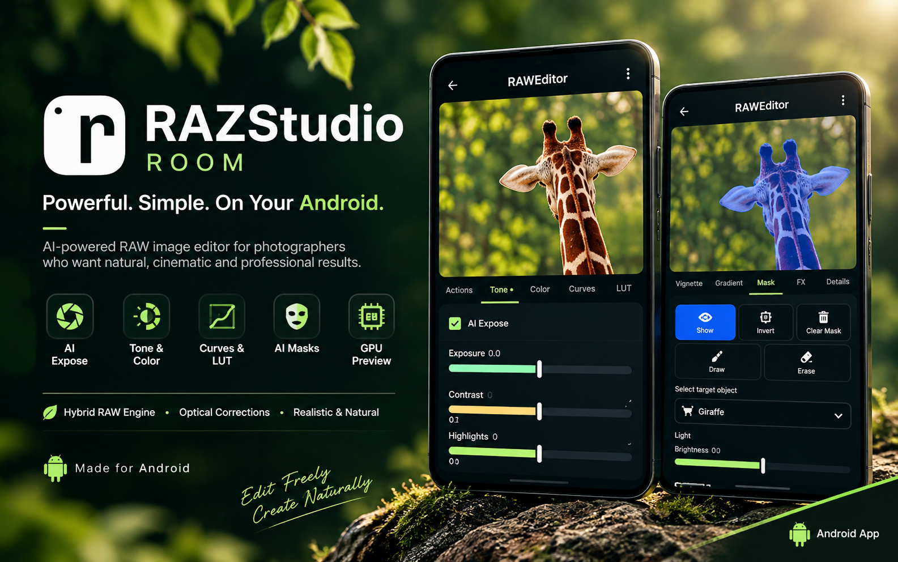

# Open RAZStudio Room

An open-source **camera-RAW photo processing** app for Android — the free edition of RAZStudio Room. Unlike filter-first mobile editors, it is built around **image reconstruction and photographer control**. Read the code, build it, install it, and run it fully offline.

---

## ✨ RAW Engine Highlights

### 📷 The First Ever Advanced Hybrid RAW Processing for Android

- Hybrid dual-demosaic reconstruction
- Detail-preserving, high-bit-depth development
- Advanced highlight recovery
- Multi-stage RAW rendering

### 🔬 Advanced Optical Corrections

A camera and lens profile database covering a large set of combinations:

- Distortion correction
- Perspective-aware vignetting
- Chromatic aberration correction
- Profile-based optical compensation

### 🎨 Photographer-Focused Color Engine

- Color Wheels
- RGB Curves
- HSL
- Split Toning
- Precision shadow / highlight and tone controls

### 🤖 AI-Assisted Local Adjustments

- Subject detection
- Multi-layer, non-destructive masks
- Selective local adjustments
- Portrait-aware editing foundation

Same masking architecture as the premium edition. Optional on-device models (subject, denoise, heal, auto-exposure, low-light) turn themselves off if a file is missing.

### ⚡ GPU Accelerated Rendering

- OpenGL live preview and GPU-assisted grading
- High-resolution RAW previews
- Accelerated export on the modern Android graphics stack

### 🌫️ Creative Photography Tools

- Depth-aware bokeh
- Bloom
- Vintage styling

## 🚫 FOSS Edition Limitations

Premium-only (not in this release):

- RAW LUT and LUT Adj 
- Gallery Workspace, project import/export, sidecars, Add to Project
- Sony / Canon project integration
- LUT Creator and Short Video

---

## Technical specs

| | |
|---|---|
| Version | 1.0.1.4-alpha |
| Package | `com.RAZStudio.StudioRoom` |
| Min Android | 8.0 (API 26) |
| ABI | arm64-v8a |
| JDK / compileSdk | 21 / 37 |
| Trial / expiry | none |

## Technology stack

- **UI:** Kotlin, Jetpack Compose (Material 3)
- **App:** modular Gradle (`:feature:*`, `:core:*`, `:lib:*`), Decompose, Hilt
- **Native NDK:** LibRaw decode, camera/lens-profile kernels
- **Imaging:** OpenCV, ONNX Runtime, TensorFlow Lite
- **Persistence:** Room + DataStore

## Source, assets, and build

The app builds without optional assets; those features stay off until you add the files.

**In this repo:** Open-edition source, Gradle/`build-logic`, and small parameter files (`ae_tone_model.tflite`, `ae_scaler_mean.npy`, `ae_scaler_scale.npy`, `raw_hdr_recovery.bin`, `raw_shadow_recovery.bin`).

**You supply:** large AI models, camera/lens profile XML, and signing keys (debug uses the Android debug key). Fetch models from their original projects and follow **their** licenses. Drop ONNX/TFLite files into `feature/photo-editor/src/main/assets/models/` (see [models README](feature/photo-editor/src/main/assets/models/README.md)). Copy profile XML into `feature/photo-editor/src/main/assets/lensfun_db/` ([folder README](feature/photo-editor/src/main/assets/lensfun_db/README.md)).

| Filename | Feature | Source |
|---|---|---|
| `birefnet_lite.onnx` | Subject/background mask | [BiRefNet](https://github.com/ZhengPeng7/BiRefNet) → ONNX |
| `u2net.onnx` | Saliency / heal base | [U²-Net](https://github.com/xuebinqin/U-2-Net) |
| `mobile_sam_encoder.onnx`, `mobile_sam_decoder.onnx` | Edge-precise mask | [MobileSAM](https://github.com/ChaoningZhang/MobileSAM) |
| `razgan.onnx` | Deep inpaint | [MI-GAN](https://github.com/Picsart-AI-Research/MI-GAN) (MIT) → ONNX |

```bash
cp local.properties.template local.properties
# edit sdk.dir=
./gradlew :app:assembleFossDebug        # gradlew.bat on Windows
adb install app/build/outputs/apk/foss/debug/Open_RAZStudio_Room-1.0.1.4-alpha-foss-arm64-v8a-debug.apk
```

Needs the Android SDK, NDK, and CMake.

## Privacy

Everything that makes the app work is local: decode, edit, preview, export, and optional AI. No network check, no Play Services / analytics in this flavor. Permissions cover the photos you open, the files you save, and camera-sync if you use it. Photos are not uploaded.

## Legal

App source: **Apache License 2.0** ([`LICENSE`](LICENSE)), with many files still carrying Apache-2.0 headers. This repo is for **transparency** (read, audit, personal builds) — not a general-purpose open-source kit.

- **Dependencies** (OpenCV, ONNX Runtime, TensorFlow Lite, LibRaw, Compose, Decompose, …) stay under their upstream licenses and are pulled from official repositories at build time.
- **Original RAZStudio modules** I authored are under the **RAZStudio Transparency License** ([`LICENSE-RAZStudio.txt`](LICENSE-RAZStudio.txt)): view, study, and build for personal use; redistribution or derivatives need written permission.
- Models and the camera/lens profile database are **not re-hosted here**. Adapted code is attributed in the source files.

Where a file header already grants Apache-2.0 (or another OSS license), that header governs the file. The Transparency License does not revoke it. Check the file you care about; if something is inconsistent, open an issue.

## Support this project

Donations are optional — the app stays free. **Touch 'n Go eWallet (Malaysia):**


Other methods, or just bug reports, feature ideas, and device/camera testing: open an issue.

## Who made this

I'm an enthusiast, not a professional photographer or trained software engineer. I started learning camera RAW processing in January 2026 and this is where I put that work. Expect rough edges; feedback is welcome.
