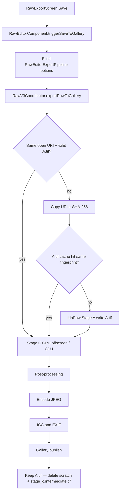

# RAW Export Page and Pipeline

## Export Page Capabilities

The RAW Export page receives a graded preview from the editor and supports:

- Crop
- Straighten
- 90-degree rotation
- Horizontal and vertical flip
- Heal/inpaint
- Border/frame
- Text, logo, and EXIF watermarks
- Saved adjustment presets
- Reset of export edits
- Share after successful save
- Navigation to the Details editor
- Original/full resolution output
- 1350 px social output
- 1600 px HD Lite output
- 1920 px HD output
- 3840 px 4K output
- Manual width and height
- Aspect-ratio locking
- Keep all EXIF metadata
- Remove sensitive EXIF metadata
- Remove all EXIF except the RAZStudio software tag
- Optional sRGB ICC embedding
- Cancellable save progress

The visible export format is currently JPEG. The internal export model also contains PNG, 16-bit PNG, TIFF, WebP, HEIC, AVIF, JPEG 2000, and JPEG XL paths.

## Complete Save Flow



Stage B lives in the editor preview. Save does **not** walk Stage B. The export page proxy **does** call the same `exportRawToGallery` at 1280 px, so opening the page already paid one full export before Save.

## Stage A: RAW Decode and Preparation

**Primary output:** `A.tif`

Stage A converts the RAW source into a linear FP16 RGBA BigTIFF.

Typical operations are:

1. Copy the SAF URI to a local scratch file.
2. Probe the source and calculate its SHA.
3. Reuse a cached `A.tif` when the cache is valid.
4. Decode the RAW through LibRaw.
5. Apply black-level and camera calibration handling.
6. Apply DNG gain-map correction when applicable.
7. Demosaic through the configured v3 path, with LibRaw fallback paths when needed.
8. Apply white balance and exposure initialization.
9. Apply HDR, highlight, and shadow recovery when configured.
10. Apply CLAHE, detail, noise, guided-filter, or enhancement processing when configured.
11. Apply a matched camera and lens profile when available.
12. Apply chromatic-aberration correction and defringe processing.
13. Apply EXIF orientation handling.
14. Write the FP16 RGBA `A.tif` cache.

Native implementation: `lib/raw-native/src/main/cpp/v3/stage_a.cpp`.

Example runtime log:

```text
Stage A 6024x4024
Stage A cache hit ... reusing A.tif
```

## Stage B: Interactive Preview

**Primary output:** `B_preview.f16`

Stage B prepares the live editor preview:

1. Downsample Stage A data for interactive use.
2. Upload or bind image data through `AHardwareBuffer`.
3. Run spatial preview passes when required.
4. Upload subject, depth, bokeh, and brush masks.
5. Render using the GLES uber-shader.
6. Apply live `ShaderParams`.
7. Display through `RawV3GlSurfaceView`.
8. Optionally serialize the preview as `B_preview.f16`.

The active preview stack includes:

- `RawV3PreviewComposable`
- `RawV3GlSurfaceView`
- `GlesRenderer`
- EGL/GLES
- `AHardwareBuffer`
- AHB mask loader
- GPU shader grading

Stage B is the live editing and preview stage. It is not the final gallery-writing stage.

## Stage C: Final Export

Stage C produces the final output pixels and sends them to the encoder.

### Preferred GPU Route

JPEG and WebP prefer the GPU offscreen route:

1. Read Stage A.
2. Build the final shader parameter array.
3. Load LUT and tone-curve data.
4. Bind segmentation, depth, bokeh, and brush masks.
5. Call `nativeRenderGradedOffscreen`.
6. Produce final working pixels at the requested output size.

Relevant native implementation:

- `lib/raw-native/src/main/cpp/v3/offscreen_save_renderer.cpp`
- `RawV3Engine.renderGradedOffscreen`
- `RawV3Coordinator.exportRawToGallery`

Example log:

```text
nativeRenderGradedOffscreen: Stage A 6024x4024 -> grade work 1280x855
```

### CPU Fallback Route

The CPU route is used when:

- GPU allocation fails.
- EGL/offscreen rendering fails.
- The requested output format requires the CPU path.
- GPU grading reports an error.

The CPU route uses:

- `lib/raw-native/src/main/cpp/v3/stage_c_export.cpp`
- `lib/raw-native/src/main/cpp/v3/apply_macro.cpp`
- `applyMacroPixelImpl`

The result is usually generated through an intermediate 16-bit RGB BigTIFF before final encoding.

## Post-Processing and Encoding

After Stage C grading, the pipeline may perform:

1. Bokeh or depth blur.
2. Orientation transform.
3. Crop.
4. Straighten.
5. Rotation and flips.
6. Resize.
7. Output sharpening.
8. Optional DnCNN export denoise.
9. Watermark burn-in.
10. Outer border/frame compositing.
11. JPEG, WebP, HEIC, AVIF, PNG, or TIFF encoding.
12. ICC profile insertion.
13. EXIF preservation or stripping.
14. FileController or MediaStore publication.
15. Saved URI delivery back to the export page.
16. Share action activation.

## Proxy Export Path

When the export page is open and the action stack changes, the page refreshes its preview through a proxy export:

```text
RawEditorContent
  -> shaderParamsFlow
  -> renderExportProxy()
  -> exportRawToGallery()
  -> nativeRenderGradedOffscreen()
```

The proxy writes a temporary JPEG into the app cache, decodes it into a bitmap, and displays it on the export page. It does not publish the proxy file to the gallery.

Proxy exports are now serialized so that:

- Only one proxy export runs in native code at a time.
- Newer requests wait behind the active request.
- Stale results are discarded.
- Proxy `START`, `QUEUED`, `COMPLETE`, and `FAILED` states are logged.
- Exceptions are preserved in logs instead of being reduced to `result=null`.

## Second save of the same photo (cost audit)

Same RAW still open in the editor, Export page, Save, then Save again with the same bitmap / same grade. This is **not** a second encode of the on-screen preview.

### What Save actually does

Unless Heal / Online AI left a non-null `overrideBitmap`, Save always calls `exportRawToGallery`. That path is full-res Stage A → Stage C → encode. The export-page bitmap is display only.

### Time buckets (typical 24 MP RAW)

| Step | Save 1 | Save 2 (before keep-A.tif) | Save 2 (after keep-A.tif) |
|---|---|---|---|
| SAF copy of the RAW to `raw_v3_in_*.bin` | always | always | **skipped** if same open session |
| SHA-256 of that scratch | always | always | **skipped** with the copy |
| LibRaw Stage A → `cacheDir/raw_v3/<sha>/A.tif` | miss (10–20s) | miss again — cleanup deleted the SHA dir | **hit** (`Stage A cache hit`) |
| Wait subject/cityscapes if params need masks | if missing | if missing | usually already on disk |
| Delete `stage_c.intermediate.tif` | always | always | always (by design) |
| GPU `nativeRenderGradedOffscreen` or CPU Stage C | always | always | **always** |
| Crop / straighten / resize / watermark / JPEG / EXIF / MediaStore | always | always | always |

The wipe that made Save 2 feel like Save 1: success `cleanup(scratch, stageATif.parentFile, intermediate)` ran `deleteRecursively()` on the SHA folder. That is now `cleanup(scratch, intermediate)` so `A.tif` and Stage A meta survive. Stage A **failure** still purges the SHA dir.

Session `closeSession()` already kept A.tif (M10). Only the export cleanup was deleting it.

### Work that is still duplicated on purpose or by gap

1. **Copy + SHA** — skipped when `exportRawToGallery` runs on the **same coordinator session** (`openUri` + `openSha` + valid A.tif fingerprint). Log: `skip copy+SHA (open session A.tif)`. Batch and a different URI still copy+hash.

2. **Stage C every save.** Intermediate TIFF is deleted so a second JPEG is a fresh grade. Required if crop, size, quality, LUT, or actions changed. Identical second save still re-grades GPU at full res — seconds, not LibRaw tens of seconds.

3. **Export proxy is a third pipeline.** Opening Export runs `renderExportProxy` → `exportRawToGallery` at 1280 px (copy, SHA, Stage A hit, Stage C, JPEG, decode, delete proxy file). Then Save runs it again at the chosen long side. Proxy does not publish to the gallery.

4. **Fingerprint miss looks like a wipe.** Workspace string in Stage A meta must match (`effectiveWorkspace.toString() + "|lfa=3"`). Lens/profile/demosaic change forces a full Stage A even if A.tif exists.

5. **Route poison.** Route B will not reuse a Route-A–baked A.tif (`.camprofile` marker). Re-decode is correct.

6. **`overrideBitmap` is not a full-res shortcut.** Heal / cloud preview bitmaps are preview-sized. Normal Save must not take that path.

### Logs to confirm on device

```text
skip copy+SHA (open session A.tif)
Stage A cache hit … reusing A.tif     ← Save 2 after the cleanup fix
Stage A cache fingerprint changed     ← not a cache; options changed
cached A.tif is Route-A baked …       ← forced re-decode
nativeRenderGradedOffscreen: Stage A WxH → grade work …
export proxy START / COMPLETE
```

If Save 2 still logs a LibRaw Stage A with no fingerprint/route line, the APK does not include the keep-A.tif cleanup yet.

## Important Fallbacks and Limitations

- The visible export UI is currently JPEG-oriented even though the internal model supports more formats.
- GPU JPEG/WebP grading falls back to CPU Stage C if GPU rendering or allocation fails.
- Cancellation is cooperative; native work finishes its current call before the coroutine stops.
- Missing segmentation disables subject-gated effects or bokeh masking.
- Lens correction requires a confident camera and lens match.
- Camera-profile matching falls back to the user tone curve when no usable profile is available.
- Heal or override-bitmap saves may preserve a preview-sized bitmap instead of rerunning the full-resolution RAW pipeline.
- LUT parsing uses the native parser first and an ASCII `.cube` parser as fallback. If both fail, export continues without the LUT.
- Stage B is the live preview path; Stage C is the final export path.

## Main Source Files

- `feature/photo-editor/src/main/java/com/RAZStudio/StudioRoom/feature/photo_editor/presentation/raw/RawExportScreen.kt`
- `feature/photo-editor/src/main/java/com/RAZStudio/StudioRoom/feature/photo_editor/presentation/raw/RawEditorComponent.kt`
- `feature/photo-editor/src/main/java/com/RAZStudio/StudioRoom/feature/photo_editor/raw_v3/RawV3Coordinator.kt`
- `feature/photo-editor/src/main/java/com/RAZStudio/StudioRoom/feature/photo_editor/raw_v3/RawEditorExportPipeline.kt`
- `feature/photo-editor/src/main/java/com/RAZStudio/StudioRoom/feature/photo_editor/raw_v3/RawV3Engine.kt`
- `lib/raw-native/src/main/cpp/v3/stage_a.cpp`
- `lib/raw-native/src/main/cpp/v3/stage_c_export.cpp`
- `lib/raw-native/src/main/cpp/v3/apply_macro.cpp`
- `lib/raw-native/src/main/cpp/v3/offscreen_save_renderer.cpp`
